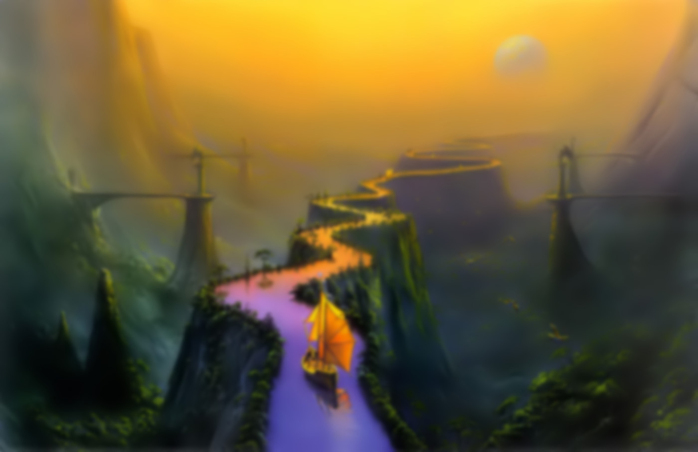
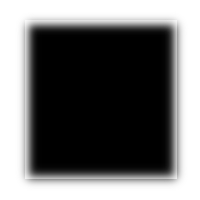
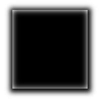

# Frosted Glass
or foggy glass, blurred div on a background, blah blah blah, etc.

### Technique 1: Photoshop
Take a regular background image

<p></p>

<p>and blur it however you like in Gimp/Photoshop:</p>

<p></p>

<p>Save the original and blurred image.</p>

<p>Set the body's background to the original image<br/>
and the div's background to the blurred image.</p>

<pre>
body {
  background: url('original_background.jpg') no-repeat;
  background-size: cover;
  background-position: center;
  background-attachment: fixed;
}

.my_div {
  background: url('blurred_background.jpg') no-repeat;
  background-size: cover;
  background-position: center;
  background-attachment: fixed;

  /* Set the width/height so you can check it out. */
  width: 70%;
  height: 200px;

  margin: 12% auto;
}
</pre>

<p><small>magik.</small></p>

### Technique 2: ::before

<blockquote>
	This gets weird on Chrome.<br/>
	When you adjust the <strong>height</strong> of the window, the div's<br/>
	background will not adjust with you.<br/>
	But adjusting the <strong>width</strong> works fine..
</blockquote>

<p>This technique is all about toying with the ::before selector of the div.</p>

<p>Take a regular background image</p>

<p></p>

<p>and set the body's background to the image.</p>

```css
body {
  background: url('original_background.jpg') no-repeat;
  background-size: cover;
  background-position: center;
  background-attachment: fixed;
}
```

<p>Here's where it gets freaky.</p>

<p>Create empty content in the div's ::before then set its z-index to -1.</p>

```css
.my_div::before {
  content: ' ';
  z-index: -1; /* places the blurred mess behind the div's content */
}
```

<p>Expand this ::before pseudo-element to fit the size of the div. Then filter it.</p>

```css
.my_div::before {
  content: ' ';
  z-index: -1; /* places the blurred mess behind the div's content */

  position: absolute; /* expand */
  width: 100%;
  height: 100%;

  filter: blur(3px); /* filter */
  -moz-filter: blur(3px);
  -webkit-filter: blur(3px);
}
```

<p>What you'll notice is that the top &amp; left edges of this div won't be blurred.</p>

<p>This is because filter affects the entire pseudo-element within its parent as seen below.</p>



<p>The solution to this issue is to expand the pseudo-element past its parent.</p>

<p>That way we get a clean blur all around.</p>



```css
.my_div::before {
  content: ' ';
  z-index: -1; /* places the blurred mess behind the div's content */

  position: absolute; /* expand */
  <b>width: 110%;
  height: 110%;</b> /*  expand past its parent's boundaries */
  <b>top: -15px;
  left: -15px;</b> /* position it to fill the top &amp; left edges */

  filter: blur(3px); /* filter */
  -moz-filter: blur(3px);
  -webkit-filter: blur(3px);
}
```

## Conclusion

Obviously using technique #1 would produce a bit more load time, but check out technique #2. On a slower windows computer running chrome, technique #2 slows down the page's maneuverability. It's your choice. A few Mb of load time versus not being able to scroll smoothly.
